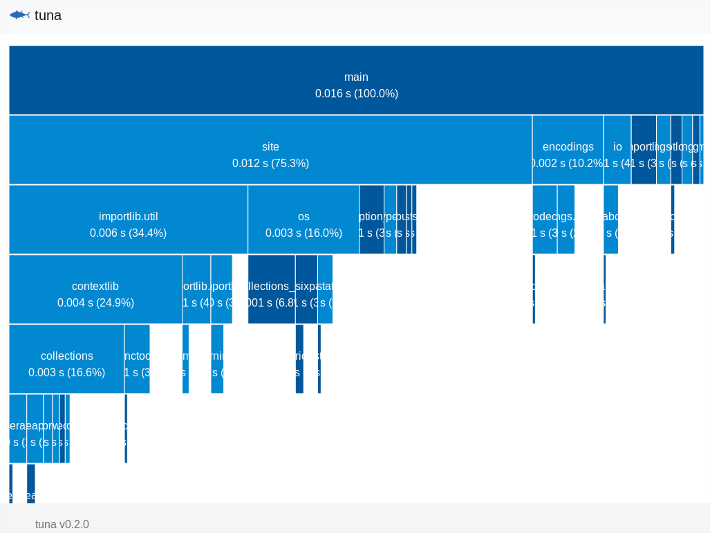

++++++++++++++++++
Python Debug Tools
++++++++++++++++++

Spoiler: Python 3.6 and newer provide a much better debugging experience!

See also :ref:`Debug a CPython crash <crash>`.

Take Away
=========

Command to enable debug tools:

* Python 3.7 and newer: ``python3 -X dev``
* Python 3.6 and newer: ``PYTHONMALLOC=debug python3 -Wd -X faulthandler``

Tools:

* faulthandler
* PYTHONMALLOC=debug: builtin memory debugger
* tracemalloc
* importtime

importtime
==========

To analyze the startup time of your application, Python 3.7 and newer have
a builtin profiler on import time: ``-X importtime`` option.

Truncated example::

   $ python3.7 -X importtime -c pass
   import time: self [us] | cumulative | imported package
   import time:       274 |        274 | zipimport
   (...)
   import time:       949 |       2055 | io
   import time:       453 |        453 |       _stat
   import time:       701 |       1154 |     stat
   import time:       595 |        595 |       genericpath
   import time:       886 |       1480 |     posixpath
   import time:      3005 |       3005 |     _collections_abc
   import time:      1922 |       7559 |   os
   (...)
   import time:      4325 |      22832 | site

An alternative is to set ``PYTHONPROFILEIMPORTTIME=1`` environment variable.

No surprise, ``site`` has the longest cumulative time. Disable ``site`` to
speedup Python :-) Example::

   $ python3.7 -X importtime -S -c pass
   import time: self [us] | cumulative | imported package
   import time:        88 |         88 | zipimport
   import time:       580 |        580 | _frozen_importlib_external
   import time:        66 |         66 |     _codecs
   import time:       498 |        564 |   codecs
   import time:       411 |        411 |   encodings.aliases
   import time:       678 |       1653 | encodings
   import time:       232 |        232 | encodings.utf_8
   import time:       155 |        155 | _signal
   import time:       341 |        341 | encodings.latin_1
   import time:        56 |         56 |     _abc
   import time:       273 |        329 |   abc
   import time:       298 |        626 | io

`tune <https://github.com/nschloe/tuna>`_ is a Python profile viewer which
accepts importtime logs as input, see `Nico Schlömer's comment on bpo-31415
<https://bugs.python.org/issue31415#msg320841>`_. Extract::

   python -X importprofile application.py 2>import.log
   tuna import.log

Example with ``python3.7 -X importtime -c pass``:

See also `How to speed up Python application startup time
<https://dev.to/methane/how-to-speed-up-python-application-startup-time-nkf>`_
(Jan, 2018) by INADA Naoki.

.. _faulthandler:

Get a traceback on a crash
==========================

Example of crash, ``crash.py``::

    import ctypes

    def bug():
        ctypes.string_at(0)

    bug()

Output::

    $ python3 crash.py
    Segmentation fault (core dumped)

... not very helpful :-( Enable faulthandler to get the Python traceback where
the crash occurred. ``python3 -X dev`` (Python 3.7 and newer) enables
automatically faulthandler.

faulthandler provides a traceback on a crash::

    $ python3 -X faulthandler crash.py
    Fatal Python error: Segmentation fault

    Current thread 0x00007f3bb3998700 (most recent call first):
      File "/usr/lib64/python3.6/ctypes/__init__.py", line 487 in string_at
      File "crash.py", line 4 in bug
      File "crash.py", line 6 in <module>
    Segmentation fault (core dumped)

To debug a deadlock, ``faulthandler.dump_traceback_later()`` can be implemented
to implement a "watchdog": dump the traceback where Python is stuck if Python
main code is blocked for longer than N seconds, and exit Python.

ResourceWarning
===============

Example which doesn't close explicitly a file::

    def func():
        f = open(__file__)
        f = None

    func()

Output (or lack of output)::

    $ python3 filebug.py

... ResourceWarning warnings are hidden by default::

    $ python3.6 -c 'import pprint, warnings; pprint.pprint(warnings.filters)'
    [('ignore', None, <class 'DeprecationWarning'>, None, 0),
     ...
     ('ignore', None, <class 'ResourceWarning'>, None, 0)]

Use ``python3 -X dev`` (Python 3.7 and newer) or ``python3 -Wd`` (Python 3.6
and older) to display ``ResourceWarning``::

    $ python3 -Wd filebug.py
    filebug.py:3: ResourceWarning: unclosed file <_io.TextIOWrapper name='filebug.py' mode='r' encoding='UTF-8'>
      f = None

On Python 3.6 and newer, enabling tracemalloc shows where the resource (file in
this example) has been created::

    $ python3 -Wd -X tracemalloc=5 filebug.py
    filebug.py:3: ResourceWarning: unclosed file <_io.TextIOWrapper name='filebug.py' mode='r' encoding='UTF-8'>
      f = None
    Object allocated at (most recent call first):
      File "filebug.py", lineno 2
        f = open(__file__)
      File "filebug.py", lineno 5
        func()

Memory Debugger
===============

Memory managment in C is complex and error-prone.

Python has multiple allocators which are more or less compatible, but not
always. For example, `PyMem_Malloc()
<https://docs.python.org/dev/c-api/memory.html#memory-interface>`_ uses
``malloc()`` in Python 3.5 and older, but ``pymalloc`` in Python 3.6 and newer.
Releasing memory allocated by ``PyMem_Malloc()`` using ``PyObject_Free()``
worked until Python 3.5, but "can" crash on Python 3.6 (depending if the memory
block is longer than 512 bytes or not...).

Since Python 3.6, the new `PYTHONMALLOC environment variable
<https://docs.python.org/dev/using/cmdline.html#envvar-PYTHONMALLOC>`_ allows
to change the memory allocator at runtime (when starting Python).

``PYTHONMALLOC=debug`` enables Python builtin memory debugger:
`PyMem_SetupDebugHooks()
<https://docs.python.org/dev/c-api/memory.html#c.PyMem_SetupDebugHooks>`_.
``python3 -X dev`` (Python 3.7 and newer) enables automatically
``PYTHONMALLOC=debug``.

Example ``membug.py``::

    import _testcapi

    def main():
        _testcapi.pymem_buffer_overflow()

    main()

Output::

    $ PYTHONMALLOC=debug ./python membug.py
    Debug memory block at address p=0x7f7c0ed9f160: API 'm'
        16 bytes originally requested
        The 7 pad bytes at p-7 are FORBIDDENBYTE, as expected.
        The 8 pad bytes at tail=0x7f7c0ed9f170 are not all FORBIDDENBYTE (0xfb):
            at tail+0: 0x78 *** OUCH
            at tail+1: 0xfb
            at tail+2: 0xfb
            at tail+3: 0xfb
            at tail+4: 0xfb
            at tail+5: 0xfb
            at tail+6: 0xfb
            at tail+7: 0xfb
        The block was made by call #28431 to debug malloc/realloc.
        Data at p: cb cb cb cb cb cb cb cb cb cb cb cb cb cb cb cb

    Fatal Python error: bad trailing pad byte

    Current thread 0x00007f7c0ee875c0 (most recent call first):
      File "membug.py", line 4 in main
      File "membug.py", line 6 in <module>
    Aborted (core dumped)

Python dumps the current traceback where the bug has been allocated, but it can
be "too late".

On Python 3.6 and newer, enabling tracemalloc allows to find where the memory
block has been allocated which can help to investigate the bug (truncated
output to highlight the difference)::

    $ PYTHONMALLOC=debug ./python -X tracemalloc=5 membug.py
    (...)
    Memory block allocated at (most recent call first):
      File "membug.py", line 4
      File "membug.py", line 6
    (...)

Traceback with source code recreated manually::

    Memory block allocated at (most recent call first):
      File "membug.py", line 4
        _testcapi.pymem_buffer_overflow()
      File "membug.py", line 6
        main()

On this artificial example, the current Python traceback and memory block
allocation traceback are the same, but usually they are different.

Sadly, on Python 3.5 and older, the only way to get the Python builtin memory
allocator is to recompile Python (ex: using ``./configure --with-pydebug``
which changes the ABI...).

gc.set_threshold(5)
===================

https://mail.python.org/pipermail/python-dev/2018-June/153857.html

gdb: watch when reference count changes
=======================================

Use a memory breakpoint like::

    watch ((PyObject*)MEMORY_ADDRESS)->ob_refcnt

where ``MEMORY_ADDRESS`` is the address of a Python object.
